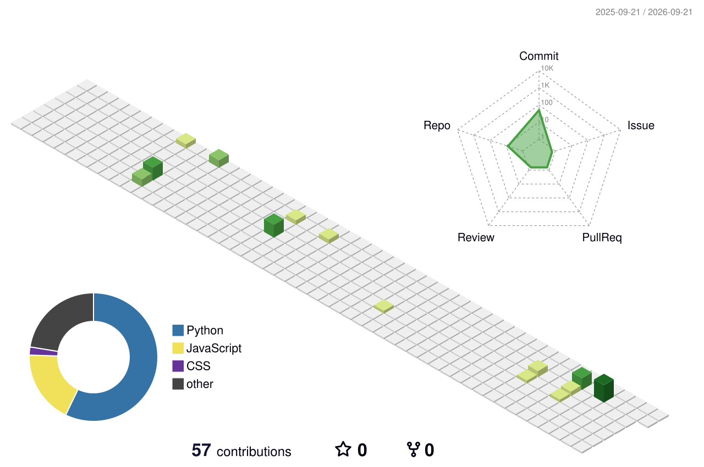

<div align="center">

# `YASWANTH NARA`

### `AI/ML` • `GENAI` • `PYTHON`


<br>

[](https://github.com/yaswanth09-tech)
[](https://www.python.org/)
[](https://www.tensorflow.org/)

</div>

---

## `> whoami`

```text
Yaswanth Nara
├── AI / ML Developer
├── GenAI Enthusiast
├── Python Developer
└── Builder of practical AI systems
```

I'm passionate about building **AI-powered solutions for real-world problems**.

My interests include:

* 🤖 Artificial Intelligence & Machine Learning
* 🧠 Generative AI & LLM applications
* 💬 Natural Language Processing
* 👁️ Computer Vision
* 🐍 Python development
* 🧩 Data Structures & Algorithms

> **Build → Learn → Improve → Repeat.**

---

## `> tech_stack`

<div align="center">

### `LANGUAGES`


### `AI / ML`


### `WEB / DATABASE / TOOLS`


</div>

---

## `> featured_projects`

<table>
<tr>

<td width="50%" valign="top">

### `01` — Resume Classifier

AI/NLP project for analyzing and classifying resumes.

**Focus**

```text
NLP
Machine Learning
Python
Text Classification
```

[→ View Repository](https://github.com/yaswanth09-tech/resume-classifier)

</td>

<td width="50%" valign="top">

### `02` — ReviewInsight

Intelligent analysis of textual reviews to extract useful insights.

**Focus**

```text
NLP
Sentiment Analysis
Python
AI
```

[→ View Repository](https://github.com/yaswanth09-tech/Reviewinsight)

</td>

</tr>

<tr>

<td width="50%" valign="top">

### `03` — TextIQ

A text-intelligence project exploring AI-powered text analysis.

**Focus**

```text
NLP
Text Processing
Python
AI
```

[→ View Repository](https://github.com/yaswanth09-tech/TextIQ)

</td>

<td width="50%" valign="top">

### `04` — Next AI Project

Currently exploring ideas around:

```text
Computer Vision
Generative AI
Intelligent Automation
Real-world AI
```

</td>

</tr>
</table>

---

## `> github_stats`

<div align="center">


</div>

---

## `> contribution_activity`

<div align="center">



</div>

---

## `> contribution_snake`

<div align="center">


</div>

---

## `> current_focus`

```text
┌─────────────────────────────────────────────────────┐
│                                                     │
│  [01] Machine Learning                              │
│  [02] Generative AI                                 │
│  [03] NLP / LLM Applications                        │
│  [04] Computer Vision                               │
│  [05] Data Structures & Algorithms                  │
│  [06] Building Real-World AI Applications           │
│                                                     │
└─────────────────────────────────────────────────────┘
```

---

## `> learning_path`

```text
                         ┌───────────────┐
                         │    PYTHON     │
                         └───────┬───────┘
                                 │
                    ┌────────────┴────────────┐
                    ↓                         ↓
             ┌──────────────┐         ┌──────────────┐
             │ MACHINE      │         │ SOFTWARE     │
             │ LEARNING     │         │ DEVELOPMENT  │
             └──────┬───────┘         └──────────────┘
                    │
          ┌─────────┼─────────┐
          ↓         ↓         ↓
        NLP       CV       DEEP LEARNING
          │         │
          └────┬────┘
               ↓
        ┌──────────────┐
        │  GENERATIVE  │
        │      AI      │
        └──────┬───────┘
               ↓
        ┌──────────────┐
        │ REAL-WORLD   │
        │ AI SYSTEMS   │
        └──────────────┘
```

---

## `> developer_metrics`

<div align="center">


</div>

---

## `> connect`

<div align="center">

<a href="https://github.com/yaswanth09-tech">

</a>

<a href="YOUR_LINKEDIN_URL">

</a>

</div>

<br>

<div align="center">

```text
┌──────────────────────────────────────────────┐
│                                              │
│       "Build things that are useful."        │
│                                              │
└──────────────────────────────────────────────┘
```


</div>
