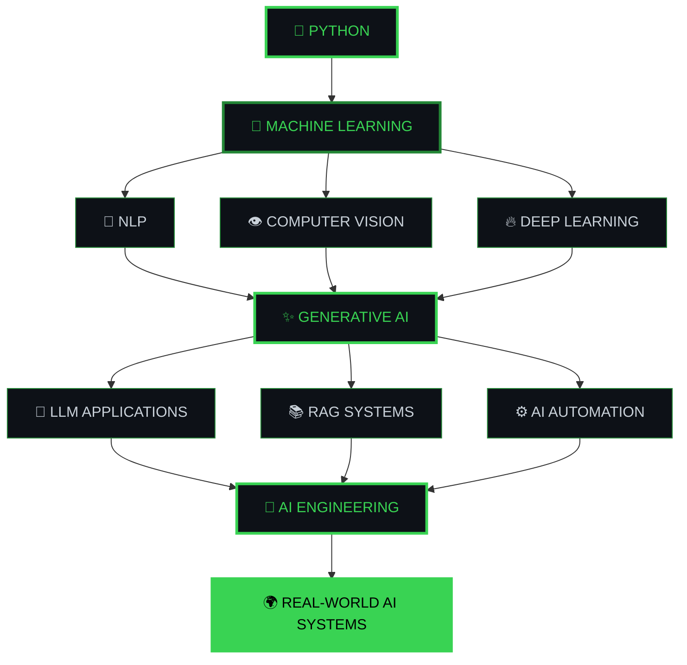

<div align="center">


<h1>Building AI Systems That Solve Real Problems</h1>

<p>
AI / ML Developer &nbsp;•&nbsp; GenAI Builder &nbsp;•&nbsp; Python Developer
</p>

<p>
<a href="https://github.com/yaswanth09-tech">

</a>

<a href="https://www.linkedin.com/in/yaswanth-nara-0914ab321/">

</a>

</p>

<br>


</div>

---

## `> whoami`

<div align="center">

<table>
<tr>

<td width="65%" valign="top">

<h2>👋 Yaswanth Nara</h2>

<h3>AI / ML Developer • GenAI Builder • Python Developer</h3>

<p>
I build <b>AI-powered applications</b> that turn real-world problems into practical software.
</p>

<p>
My work spans <b>Machine Learning, Generative AI, NLP, LLM applications,
Computer Vision</b> and end-to-end AI systems.
</p>

<br>

<table>
<tr>
<td align="center">🎓<br><b>B.Tech AIML</b></td>
<td align="center">🤖<br><b>AI / ML</b></td>
<td align="center">✨<br><b>GenAI</b></td>
</tr>
</table>

</td>

<td width="35%" align="center">

<h3>⚡ CURRENT FOCUS</h3>

<p>🧠 Machine Learning</p>
<p>✨ Generative AI</p>
<p>💬 NLP & LLMs</p>
<p>👁️ Computer Vision</p>
<p>⚙️ AI Engineering</p>
<p>🚀 Real-World Systems</p>

</td>

</tr>
</table>

<br>

<blockquote>
<b>Think → Build → Test → Improve → Deploy</b>
</blockquote>

</div>

---

## `> what_i_build`

<div align="center">

<table>

<tr>

<td width="33%" align="center">

<h2>🧠</h2>

<h3>Machine Learning</h3>

<p>
Building predictive and intelligent systems using ML and deep learning.
</p>

</td>

<td width="33%" align="center">

<h2>✨</h2>

<h3>Generative AI</h3>

<p>
Exploring LLMs, RAG, AI assistants and intelligent automation.
</p>

</td>

<td width="33%" align="center">

<h2>⚙️</h2>

<h3>AI Engineering</h3>

<p>
Turning models into usable end-to-end applications.
</p>

</td>

</tr>

</table>

</div>

---

# `> featured_projects`

## 🚀 Intervia — AI-Powered Adaptive Interview Analyzer

<div align="center">

<a href="https://github.com/yaswanth09-tech/intervia-ai-interview-platform">


</a>

</div>

**Intervia** is an AI-powered interview platform designed to simulate interviews, analyze candidate responses and identify skill gaps.

### What it does

```text
Resume
   │
   ▼
Resume Analysis
   │
   ▼
Personalized Questions
   │
   ▼
AI Interview
   │
   ├──────────────┐
   ▼              ▼
Text Response   Voice Response
   │              │
   └───────┬──────┘
           ▼
      AI Evaluation
           │
     ┌─────┴─────┐
     ▼           ▼
Skill Gaps    Performance
     │           │
     └─────┬─────┘
           ▼
 Personalized
 Learning Roadmap
```

### Core Features

* 📄 Resume-based question generation
* 🎯 Adaptive interview flow
* 🧠 AI-powered response evaluation
* 📊 Skill-gap identification
* 🎤 Text and voice interview support
* 📈 Candidate performance analysis
* 🗺️ Personalized learning roadmap
* 📑 Candidate reports

### Technology

`React` · `TypeScript` · `Vite` · `Tailwind` · `FastAPI` · `Python` · `MongoDB` · `LLMs` · `NLP`

---

## 🧠 TextIQ

AI-powered text intelligence application focused on processing and analyzing textual information.

**Focus:** `NLP` · `Text Processing` · `Python` · `Generative AI`

<a href="https://github.com/yaswanth09-tech/TextIQ">

</a>

---

## 📄 Resume Classifier

Machine learning application for analyzing and classifying resumes using NLP and text classification techniques.

**Focus:** `Python` · `NLP` · `Machine Learning` · `Text Classification`

<a href="https://github.com/yaswanth09-tech/resume-classifier">

</a>

---

## ⭐ ReviewInsight

NLP-based project designed to analyze textual reviews and extract useful sentiment-based insights.

**Focus:** `Python` · `NLP` · `Sentiment Analysis` · `Machine Learning`

<a href="https://github.com/yaswanth09-tech/Reviewinsight">

</a>

---

## `> tech_stack`

### 🐍 Languages

<div align="center">


</div>

### 🤖 AI / Machine Learning

<div align="center">


</div>

`Scikit-learn` · `Pandas` · `NumPy` · `TensorFlow` · `PyTorch` · `OpenCV`

### ✨ Generative AI

`LLMs` · `Generative AI` · `RAG` · `Prompt Engineering` · `Embeddings` · `AI Agents`

### 🌐 Web / Backend

<div align="center">


</div>

### 🗄️ Database / DevOps / Tools

<div align="center">


</div>

---

## `> ai_engineering_path`

<div align="center">



</div>

---

## `> developer_roadmap`

```mermaid
flowchart LR

    A["🐍 Python"]
    B["📊 Data + DSA"]
    C["🧠 Machine Learning"]
    D["🔥 Deep Learning"]
    E["💬 NLP"]
    F["👁️ Computer Vision"]
    G["✨ Generative AI"]
    H["🧠 LLMs"]
    I["📚 RAG"]
    J["🤖 AI Agents"]
    K["⚙️ AI Engineering"]
    L["🚀 Production AI"]
    M["🌍 Real-World Products"]

    A --> B
    B --> C
    C --> D
    C --> E
    C --> F

    D --> G
    E --> G

    G --> H

    H --> I
    H --> J

    I --> K
    J --> K

    K --> L
    L --> M

    style A fill:#0d1117,stroke:#39d353,color:#39d353,stroke-width:3px
    style B fill:#0d1117,stroke:#238636,color:#c9d1d9
    style C fill:#0d1117,stroke:#39d353,color:#39d353,stroke-width:3px
    style D fill:#0d1117,stroke:#238636,color:#c9d1d9
    style E fill:#0d1117,stroke:#238636,color:#c9d1d9
    style F fill:#0d1117,stroke:#238636,color:#c9d1d9
    style G fill:#0d1117,stroke:#39d353,color:#39d353,stroke-width:3px
    style H fill:#238636,stroke:#39d353,color:#ffffff,stroke-width:2px
    style I fill:#238636,stroke:#39d353,color:#ffffff,stroke-width:2px
    style J fill:#238636,stroke:#39d353,color:#ffffff,stroke-width:2px
    style K fill:#0d1117,stroke:#39d353,color:#39d353,stroke-width:3px
    style L fill:#0d1117,stroke:#39d353,color:#39d353,stroke-width:3px
    style M fill:#39d353,stroke:#39d353,color:#000000,stroke-width:4px
```

<div align="center">



</div>

---

## `> engineering_mindset`

<div align="center">

<table>

<tr>

<td align="center">

### 01

**UNDERSTAND**

Start with the actual problem.

</td>

<td align="center">

### 02

**BUILD**

Create a working solution.

</td>

<td align="center">

### 03

**TEST**

Measure whether it actually works.

</td>

<td align="center">

### 04

**IMPROVE**

Iterate using real results.

</td>

<td align="center">

### 05

**DEPLOY**

Turn it into something usable.

</td>

</tr>

</table>

<br>

```text
╭──────────────────────────────────────────────────────────╮
│                                                          │
│       THINK → BUILD → TEST → IMPROVE → DEPLOY           │
│                                                          │
╰──────────────────────────────────────────────────────────╯
```

</div>

---

## `> current_focus`

<div align="center">

<table>

<tr>

<td align="center" width="25%">

### 🤖

**AI / ML**

Machine Learning & Deep Learning

</td>

<td align="center" width="25%">

### ✨

**GENAI**

LLMs & Generative AI

</td>

<td align="center" width="25%">

### 📚

**RAG**

Retrieval-Augmented Generation

</td>

<td align="center" width="25%">

### ⚙️

**AI SYSTEMS**

Production-focused applications

</td>

</tr>

</table>

</div>

---

## `> github_stats`

<div align="center">


<br><br>


</div>

---

## `> contribution_activity`

<div align="center">

<!--
This image requires the GitHub Action that generates:
profile-3d-contrib/profile-night-green.svg

If the file does not exist yet, use the fallback below.
-->


</div>

---

## `> contribution_snake`

<div align="center">


</div>

---

## `> currently_building`

<div align="center">

<table>

<tr>

<td width="33%" align="center">

<h2>🚀</h2>

<h3>AI SYSTEMS</h3>

Building practical intelligent applications.

</td>

<td width="33%" align="center">

<h2>🧠</h2>

<h3>GENAI</h3>

Exploring LLM-powered applications and automation.

</td>

<td width="33%" align="center">

<h2>🔬</h2>

<h3>EXPERIMENTATION</h3>

Testing ideas and turning them into working systems.

</td>

</tr>

</table>

</div>

---

## `> connect`

<div align="center">

<h2>Let's build something useful.</h2>

<br>

<a href="https://github.com/yaswanth09-tech">

</a>

 

<a href="https://www.linkedin.com/in/yaswanth-nara-0914ab321/">

</a>

<br><br>

```text
╭────────────────────────────────────────────────────────────╮
│                                                            │
│           BUILD • LEARN • IMPROVE • REPEAT                 │
│                                                            │
╰────────────────────────────────────────────────────────────╯
```

</div>

<br>

<div align="center">


</div>
