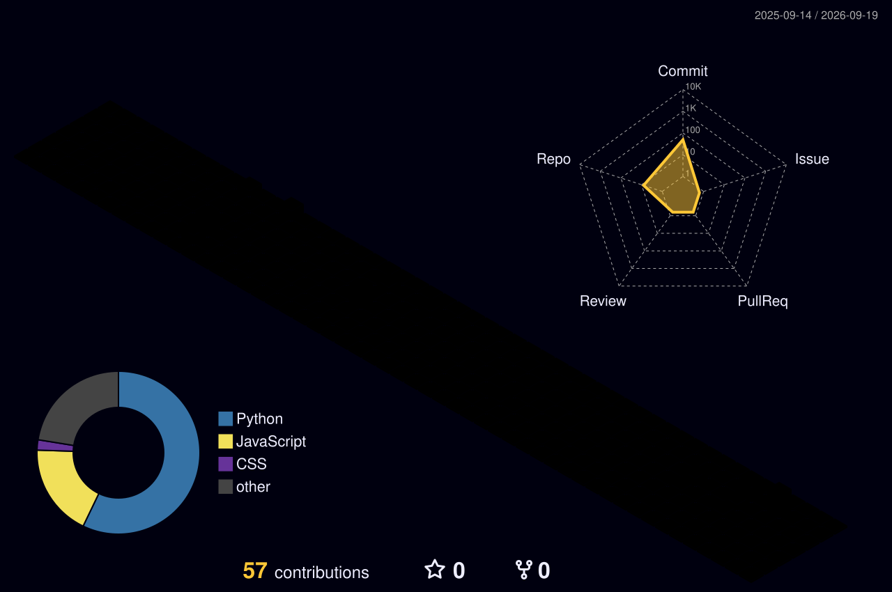

<h1 align="center">Hi 👋, I'm Yaswanth Nara</h1>

<h3 align="center">
AI/ML Developer • GenAI Enthusiast • Python Developer
</h3>

<p align="center">
  <a href="https://github.com/yaswanth09-tech">
    
  </a>
</p>

---

## 🚀 About Me

I'm an aspiring **AI/ML and GenAI developer** passionate about building practical systems that solve real-world problems.

* 🤖 Interested in **Artificial Intelligence & Machine Learning**
* 🧠 Exploring **Generative AI, NLP & LLM applications**
* 🐍 Building projects with **Python**
* 🔍 Interested in intelligent automation and real-world AI systems
* 💡 I enjoy turning ideas into working projects
* 🚀 Currently focused on improving my **DSA, ML and software development skills**

---

## 🧠 What I Build

```text
Artificial Intelligence
        ↓
Machine Learning
        ↓
NLP / Generative AI
        ↓
Real-World Applications
        ↓
Useful Software
```

My goal is not just to train models — it's to build **useful AI systems that solve meaningful problems.**

---

# 🛠️ Tech Stack

### Programming

<p>

</p>

### AI / ML

<p>

</p>

### Tools & Technologies

<p>

</p>

---

# 🚀 Featured Projects

<table>
<tr>

<td width="50%">

### 📄 Resume Classifier

An AI-powered system designed to analyze and classify resumes using machine learning / NLP techniques.

**Focus:** NLP • ML • Python

<a href="https://github.com/yaswanth09-tech/resume-classifier">
View Project →
</a>

</td>

<td width="50%">

### 📊 ReviewInsight

An intelligent review-analysis project focused on extracting useful insights from textual reviews.

**Focus:** NLP • Sentiment Analysis • AI

<a href="https://github.com/yaswanth09-tech/Reviewinsight">
View Project →
</a>

</td>

</tr>

<tr>

<td width="50%">

### 🧠 TextIQ

A text intelligence project exploring AI-powered processing and analysis of textual information.

**Focus:** NLP • Python • AI

<a href="https://github.com/yaswanth09-tech/TextIQ">
View Project →
</a>

</td>

<td width="50%">

### 🚧 More AI Projects Coming

I'm continuously building new projects around:

**Computer Vision • GenAI • NLP • Intelligent Automation**

</td>

</tr>
</table>

---

# 📊 GitHub Analytics

<p align="center">


</p>

---

# 🔥 Contribution Streak

<p align="center">


</p>

---

# 🧊 3D Contribution Graph

<p align="center">



</p>

---

# 🐍 Contribution Snake

<p align="center">


</p>

---

# 🎯 Current Focus

```text
┌─────────────────────────────────────────┐
│                                         │
│   🤖 Artificial Intelligence             │
│   🧠 Machine Learning                    │
│   ✨ Generative AI                       │
│   💬 NLP / LLM Applications              │
│   👁️ Computer Vision                     │
│   🧩 Data Structures & Algorithms        │
│   💻 Software Development                │
│                                         │
└─────────────────────────────────────────┘
```

---

# 📈 My Development Journey

```text
Python
  │
  ├── Machine Learning
  │       │
  │       ├── NLP
  │       ├── Computer Vision
  │       └── Deep Learning
  │
  └── Generative AI
          │
          ├── LLM Applications
          ├── RAG
          └── AI Automation
```

---

# 🌐 Connect With Me

<p align="center">

<a href="https://github.com/yaswanth09-tech">

</a>

<a href="https://www.linkedin.com/">

</a>

</p>

---

<p align="center">

### 💭 "Build things that are useful."

</p>

<p align="center">

</p>
