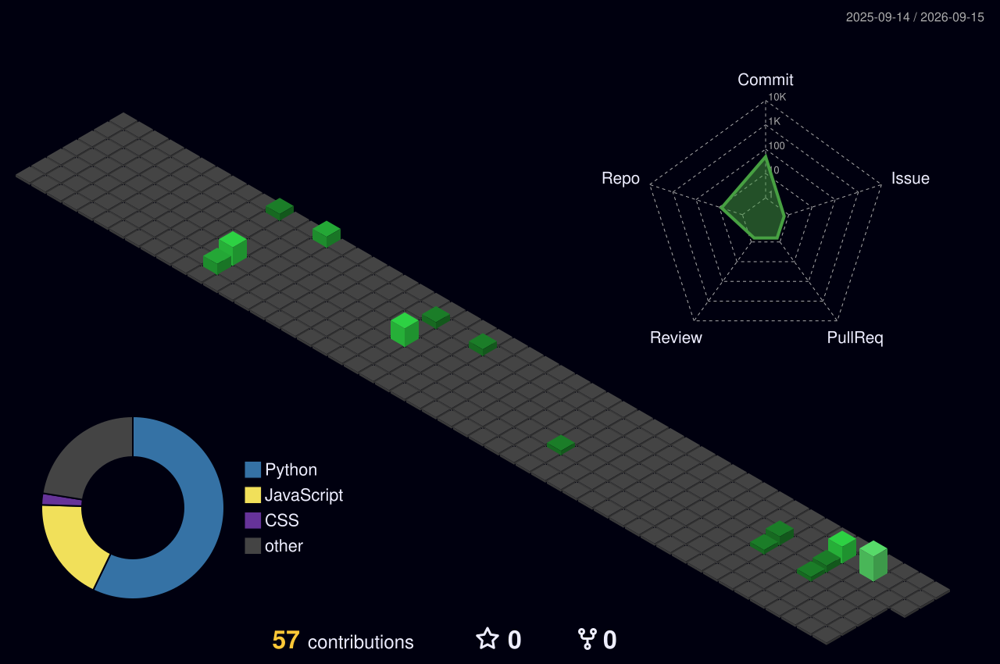

<div align="center">


<h2>Building Intelligent Systems</h2>

<p>
AI / ML Developer &nbsp;•&nbsp; GenAI Enthusiast &nbsp;•&nbsp; Python Developer
</p>

<p>
<a href="https://github.com/yaswanth09-tech">

</a>
<a href="https://www.python.org/">

</a>
<a href="https://www.tensorflow.org/">

</a>
</p>

</div>

---

## `> whoami`

```text
Yaswanth Nara
│
├── AI / ML Developer
├── GenAI Enthusiast
├── Python Developer
└── Builder of practical AI systems
```

I'm passionate about building **AI-powered solutions for real-world problems**.

### `> interests`

* 🤖 Artificial Intelligence & Machine Learning
* 🧠 Generative AI & LLM Applications
* 💬 Natural Language Processing
* 👁️ Computer Vision
* 🐍 Python Development
* 🧩 Data Structures & Algorithms

> **Build → Learn → Improve → Repeat.**

---

## `> tech_stack`

<div align="center">

### `LANGUAGES`

<p>

</p>

### `AI / ML`

<p>

</p>

### `WEB / DATABASE / TOOLS`

<p>

</p>

</div>

---

## `> featured_projects`

<table>
<tr>
<td width="50%" valign="top">

<h3>01 — Resume Classifier</h3>

<p>
An AI/NLP project for analyzing and classifying resumes.
</p>

<b>Focus</b>

<p>
<code>NLP</code>
<code>Machine Learning</code>
<code>Python</code>
<code>Text Classification</code>
</p>

<a href="https://github.com/yaswanth09-tech/resume-classifier">
→ View Repository
</a>

</td>

<td width="50%" valign="top">

<h3>02 — ReviewInsight</h3>

<p>
An intelligent review-analysis project focused on extracting useful insights from textual reviews.
</p>

<b>Focus</b>

<p>
<code>NLP</code>
<code>Sentiment Analysis</code>
<code>Python</code>
<code>AI</code>
</p>

<a href="https://github.com/yaswanth09-tech/Reviewinsight">
→ View Repository
</a>

</td>
</tr>

<tr>
<td width="50%" valign="top">

<h3>03 — TextIQ</h3>

<p>
A text-intelligence project exploring AI-powered processing and analysis of textual information.
</p>

<b>Focus</b>

<p>
<code>NLP</code>
<code>Text Processing</code>
<code>Python</code>
<code>AI</code>
</p>

<a href="https://github.com/yaswanth09-tech/TextIQ">
→ View Repository
</a>

</td>

<td width="50%" valign="top">

<h3>04 — Next AI Project</h3>

<p>
Currently exploring new ideas around practical AI applications.
</p>

<b>Exploring</b>

<p>
<code>Computer Vision</code>
<code>Generative AI</code>
<code>Automation</code>
<code>Real-World AI</code>
</p>

</td>
</tr>
</table>

---

## `> github_stats`

<div align="center">


</div>
---

## `> contribution_activity`

<div align="center">



</div>

---

## `> contribution_snake`

<div align="center">


</div>

---

## `> current_focus`

<div align="center">

<table>
<tr>
<td align="center">🤖<br><b>Machine Learning</b></td>
<td align="center">🧠<br><b>Generative AI</b></td>
<td align="center">💬<br><b>NLP / LLMs</b></td>
</tr>
<tr>
<td align="center">👁️<br><b>Computer Vision</b></td>
<td align="center">🧩<br><b>DSA</b></td>
<td align="center">⚙️<br><b>AI Applications</b></td>
</tr>
</table>

</div>

---

## `> learning_path`

<div align="center">

```text
                    ┌───────────────┐
                    │    PYTHON     │
                    └───────┬───────┘
                            │
              ┌─────────────┴─────────────┐
              │                           │
              ▼                           ▼
      ┌───────────────┐           ┌───────────────┐
      │ MACHINE       │           │ SOFTWARE      │
      │ LEARNING      │           │ DEVELOPMENT   │
      └───────┬───────┘           └───────────────┘
              │
       ┌──────┼──────┐
       │      │      │
       ▼      ▼      ▼
      NLP     CV   DEEP LEARNING
       │      │
       └──────┼──────┘
              │
              ▼
       ┌───────────────┐
       │  GENERATIVE   │
       │      AI       │
       └───────┬───────┘
               │
               ▼
       ┌───────────────┐
       │ REAL-WORLD    │
       │ AI SYSTEMS    │
       └───────────────┘
```

</div>

---
---

## `> learning_path`

<div align="center">

<table>
<tr>
<td align="center" width="20%">

### 🐍

**PYTHON**

</td>

<td align="center" width="20%">

### 🧠

**MACHINE<br>LEARNING**

</td>

<td align="center" width="20%">

### 💬

**NLP**

</td>

<td align="center" width="20%">

### 👁️

**COMPUTER<br>VISION**

</td>

<td align="center" width="20%">

### ✨

**GENAI**

</td>
</tr>
</table>

<br>

```text id="r3t7qm"
PYTHON
   │
   ├── MACHINE LEARNING
   │       │
   │       ├── NLP
   │       ├── COMPUTER VISION
   │       └── DEEP LEARNING
   │
   └── GENERATIVE AI
           │
           ├── LLM APPLICATIONS
           ├── AI AUTOMATION
           └── REAL-WORLD SYSTEMS
```

</div>

---

## `> currently_building`

<div align="center">

<table>
<tr>

<td width="33%" align="center">

### 🤖

**AI SYSTEMS**

Building practical intelligent applications.

</td>

<td width="33%" align="center">

### 🧠

**GENAI**

Exploring LLM-powered applications and automation.

</td>

<td width="33%" align="center">

### 🚧

**NEW PROJECTS**

Turning real-world problems into software.

</td>

</tr>
</table>

</div>

---

## `> developer_stats`

<div align="center">


</div>

---

## `> connect`

<div align="center">

### Let's build something useful.

<br>

<a href="https://github.com/yaswanth09-tech">

</a>

 

<a href="https://www.linkedin.com/in/yaswanth-nara-0914ab321/">

</a>

</div>

<br>

<div align="center">

```text id="8k8s1v"
┌──────────────────────────────────────────────────────┐
│                                                      │
│        BUILD  •  LEARN  •  IMPROVE  •  REPEAT       │
│                                                      │
└──────────────────────────────────────────────────────┘
```

</div>

<br>

<div align="center">


</div>

